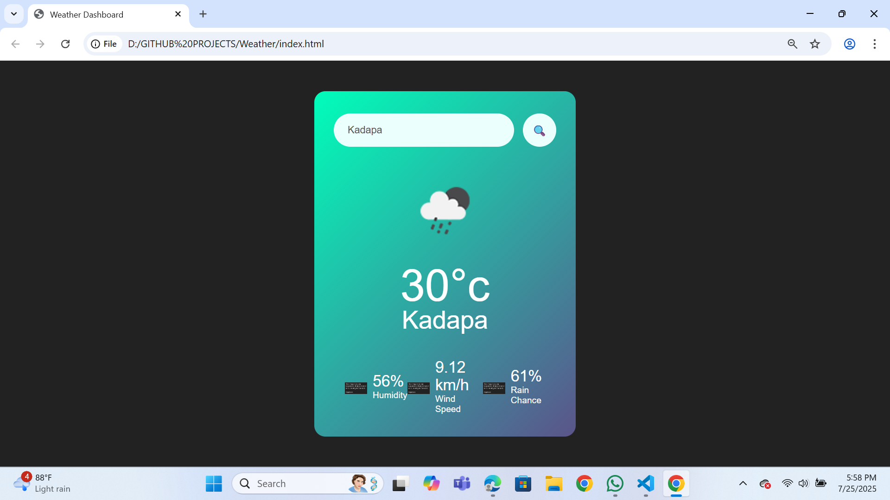

A clean and simple weather dashboard that provides real-time weather information for any city. This web application fetches data from the OpenWeatherMap API to display current conditions, including temperature, humidity, wind speed, and the probability of rain.

---

## 🚀 Live Demo

You can easily host this project for free using GitHub Pages. Once you've pushed your code to your GitHub repository:

1. Go to your repository's **Settings** tab.
2. Select **Pages** from the left sidebar.
3. Under "Branch", select your main branch (e.g., `main`) and click **Save**.
4. Your site will be live in a few minutes at `https://your-username.github.io/your-repository-name/`.

**[➡️ Add Your Live Demo Link Here!]https://weathersrr.netlify.app/**

---

## ✨ Features

- **Current Weather:** Get up-to-the-minute data on temperature, humidity, and wind speed.
- **Rain Probability:** See the chance of precipitation for the next few hours.
- **Dynamic Icons:** The weather icon changes to reflect the current conditions (e.g., sunny, cloudy, rainy).
- **City Search:** Search for any city in the world to get its weather forecast.
- **Error Handling:** Displays a user-friendly message for invalid city names.
- **Responsive Design:** A clean interface that works well on both desktop and mobile devices.

---

## 🛠️ Technologies Used

- **HTML5:** For the structure of the web page.
- **CSS3:** For styling the user interface.
- **JavaScript (ES6+):** For application logic and interacting with the API.
- **[OpenWeatherMap API](https://openweathermap.org/api):** Used
